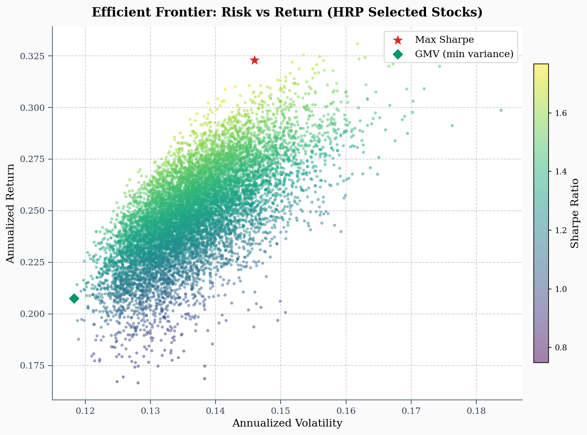
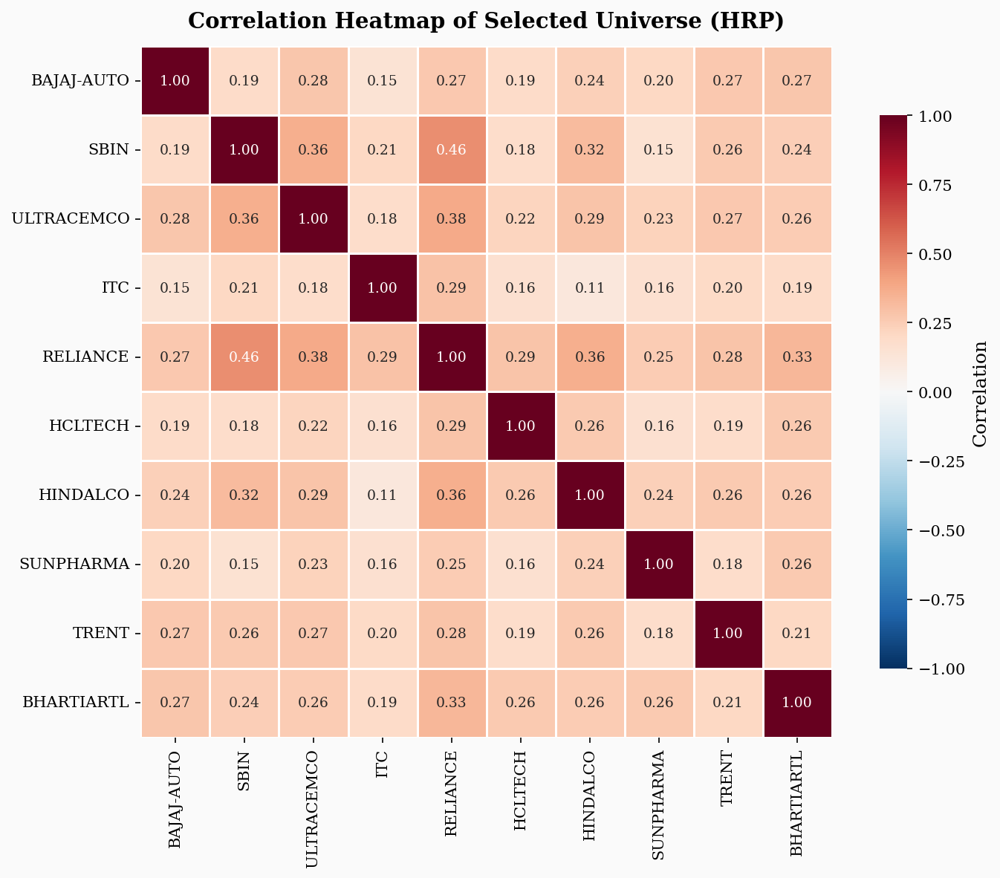
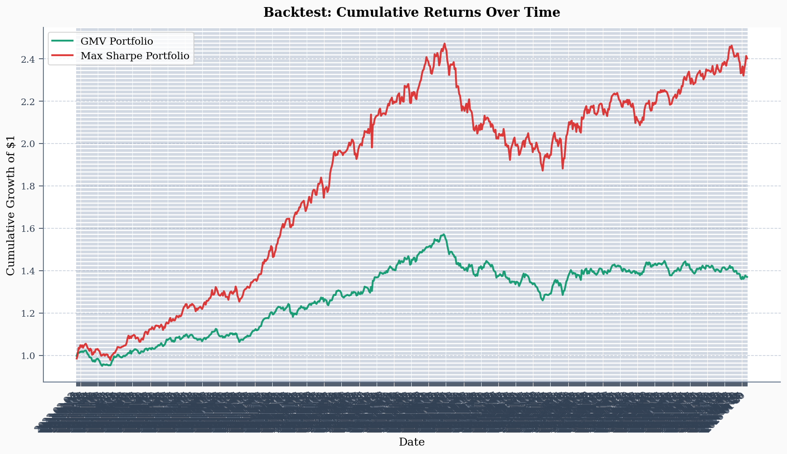
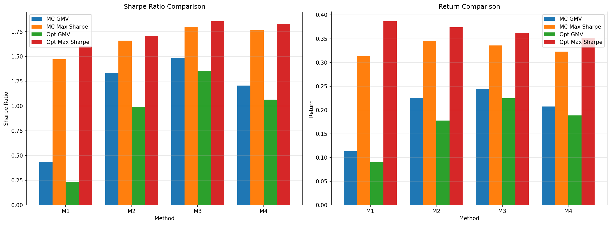

# Portfolio Optimization on 30 NIFTY Stocks

DA6701 Assignment 1. Long-only mean-variance portfolio construction on Indian equities.

The pipeline picks 10 of 30 stocks by hierarchical clustering on the correlation matrix, estimates an annualised covariance with Ledoit-Wolf shrinkage, and solves the Global Minimum Variance (GMV) and Maximum Sharpe portfolios as quadratic programs in CVXPY. A 1,000,000-portfolio Monte Carlo run draws the efficient frontier, and a walk-forward backtest with monthly rebalancing checks how the portfolios hold up out of sample.

Risk-free rate: 6.5% per year. 252 trading days. 67/33 chronological train-test split.

Built with NumPy, pandas, SciPy (clustering), scikit-learn (Ledoit-Wolf), CVXPY (OSQP backend), matplotlib, seaborn.

## Method

**Stock selection:** Compute the correlation matrix on the train split only. Convert it to a distance matrix `d_ij = sqrt((1 - rho_ij) / 2)`, run Ward-linkage agglomerative clustering, cut into 10 clusters, then pick the member with the highest in-sample Sharpe from each cluster (medoid breaks ties). Doing this on train only avoids look-ahead bias.

**Estimation:** Annualised mean returns from the train window. Covariance is Ledoit-Wolf shrunk, which matters a lot when you only have ~500 daily observations for a 10x10 matrix.

**Optimisation:** Two convex programs:

- GMV: minimise `w' Σ w` subject to `sum(w) = 1`, `0 <= w <= 0.25`.
- Max Sharpe via frontier sweep: solve `min w' Σ w s.t. mu' w >= target` for 60 target returns, then keep the weights with the best realised Sharpe. This sidesteps the non-convex direct maximisation of Sharpe.

The 25% per-asset cap is what made the test-set performance recover. Without it the optimiser puts almost everything in 3 names on the train window and falls apart out of sample.

**Monte Carlo frontier:** 1,000,000 Dirichlet-sampled long-only weight vectors with rejection sampling to enforce the cap. Computed in float32 chunks of 200,000 to stay within memory. The upper envelope of the resulting cloud is drawn alongside the QP solutions and the Capital Market Line.

**Walk-forward backtest:** Every 21 trading days inside the test window, re-fit mu and Σ on the previous 252 days, resolve both QPs, and hold those weights until the next rebalance. Reports annualised return, volatility, daily Sharpe, max drawdown and Calmar for GMV, Max Sharpe and an equal-weight baseline.

## Plots

Efficient frontier (1M portfolios, cap-aware):



Correlation of the 10 selected stocks:



Walk-forward equity curves on the test window:



Stock-selection method comparison:



## What We found

- Unconstrained Max Sharpe placed about 97% of the weight in 3 names on the train split and gave near-zero Sharpe on test. Adding the 25% cap and shrinking Σ brought test Sharpe back to near equal-weight.
- Picking the 10 stocks on the full sample vs train-only changes the selection. Train-only is the right call.
- A naive `w = rand(n); w /= w.sum()` Monte Carlo concentrates samples in the high-vol middle. Dirichlet sampling fills the edges of the frontier much better.

## Layout

```
ass1/
├── README.md
├── portfolio_optimization.ipynb     main pipeline
├── portfolio_comparison.ipynb       side-by-side of two stock-selection
│                                    methods (lowest avg correlation vs HRP)
├── daily_returns.csv / .xlsx
├── stock_categories.csv / .xlsx
├── images/                          plots
└── experiments/                     earlier iterations:
    ├── 1.ipynb                      greedy low-correlation baseline
    ├── 2.ipynb                      adds HRP, cap, rolling rebalance,
    │                                mean and Σ shrinkage
    ├── 3.ipynb                      cleaner MC-only version
    ├── jay.ipynb                    per-sector selection on 2 years
    ├── jaaay.ipynb                  same but 3 years plus a custom basket
    └── portfolio_comparison1.ipynb  near-duplicate of the comparison notebook
```

## Running it

```
pip install numpy pandas matplotlib seaborn scipy scikit-learn openpyxl cvxpy
jupyter notebook portfolio_optimization.ipynb
```

Cells run top to bottom. All knobs (seed, MC count, cap, lookback, rebalance period, Ledoit-Wolf toggle) sit in the CONFIG block at the top of the first code cell. Data files are picked up by relative path.

## Possible extensions

- Black-Litterman to bring views in and cut the reliance on noisy historical means.
- Full Hierarchical Risk Parity weighting (cluster plus recursive bisection) instead of mean-variance on the back end.
- Transaction costs in the backtest. Right now rebalances are free.
- Factor decomposition of the chosen portfolios against a market/size/value model.
